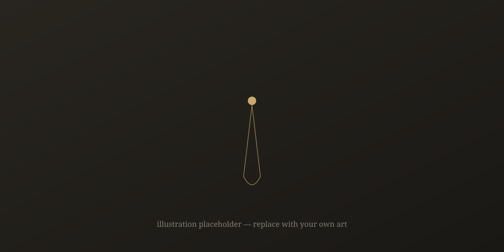

The pendant came in a tin that had once held throat lozenges, wrapped in a handkerchief that had gone the color of weak tea. Nadia found both of these things unremarkable. It was the third item — a folded page, no bigger than a playing card, covered in her grandmother's handwriting — that she almost missed, because it had slid down into the seam of the tin and stuck there.

*Do not wear this to be seen*, the page said. *Wear it to remember which way is down.*

She had no idea what that meant. She was twenty-six, her grandmother was eleven days dead, and the lawyer's office smelled like carpet cleaner and old coffee. She put the pendant on anyway, mostly because taking off her coat to dig through a tin box in front of a stranger felt worse than whatever the note implied.

## The weight of it

It was heavier than it looked — a disc of dull metal, no bigger than a thumbnail, on a chain too fine for its weight. Nadia noticed, over the following week, that she reached for it without deciding to. In the elevator. On the train, when the lights flickered. Once, absurdly, in the shower, patting at her collarbone before remembering it wasn't there.

Her grandmother had never mentioned it. Not once, in twenty-six years, had she said *there is a pendant, and someday it will be yours, and it will matter.* That omission bothered Nadia more than the note did. People don't forget to mention the important things. They choose not to.

## What her aunt said

"Ask your Aunt Ilka," the note continued, on the reverse, in smaller writing, as if she'd run out of room and refused to start a new page. "She knows the part I didn't write down."

Ilka was seventy-one and lived four hours north, in a house with too many clocks, none of them synchronized. When Nadia showed her the pendant, her aunt didn't reach for it. She looked at it the way you look at a photograph of someone who wronged you a long time ago — recognition, and then the effort of deciding how much of the old feeling to let back in.

"She wore that for thirty years," Ilka said. "Then she took it off, and she never told me why, and I never told her I noticed."

"Do you know what it's *for*?"

Ilka poured two glasses of something dark and didn't answer right away. "It's not for anything," she said finally. "It's *against* something. There's a difference, and your grandmother understood it better than anyone I've ever met."

Nadia waited. Ilka didn't say anything else that night, and it would be another three stories before anyone did.

*This story continues. Drop the next chapter's markdown file into /fiction/ and add it to the manifest to keep going.*
